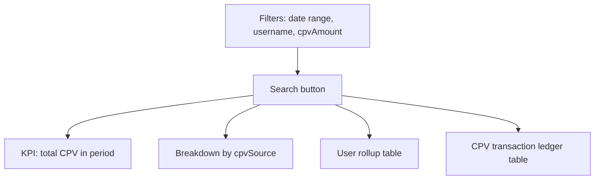

# Frontend Integration: Admin Earnings CPV Report

Date: 2026-06-08

User-centric audit of **how CPV was generated per member** within a date range: total CPV accumulated, breakdown by source, and individual CPV ledger rows.

This is **not** the same as [earnings payouts](./frontend-integration-admin-earnings-payouts.md) (system-wide cash + CPV paid out by category). This report answers: *“How much CPV did user X earn, and from what sources, in this period?”*

Related docs:

- [Product volume distribution](./frontend-integration-product-volume-distribution.md) — CPV source definitions on `order.paid`
- [Admin user operations](./frontend-integration-admin-user-operations.md) — admin CPV credit (`POST /admin/users/:id/volume/credit`)
- [Earnings payouts](./frontend-integration-admin-earnings-payouts.md) — commissions and CPV paid (category submenus)

All routes require **Bearer token** with role `ADMIN`.

---

## Why new endpoints are needed

| Existing endpoint | Limitation |
|-------------------|------------|
| `GET /admin/reports/earnings/transactions?unit=CPV` | System-wide payout feed; no `username` or CPV amount filter; mixes cash + CPV concerns |
| `GET /admin/earnings/activity?userId=` | Per-user only; requires known UUID; no username or CPV total search; no period summary |
| `GET /admin/earnings/activity/global` | Global feed; no user-centric rollup or CPV amount search |

**Recommendation:** implement dedicated `/admin/reports/cpv/*` routes. Do **not** overload `GET /admin/reports/earnings/transactions`.

---

## Admin UI intent (future frontend)

New sidebar item under **Earnings Payouts**: **CPV** → `/admin/reports/earnings/cpv`.



### Search controls

| Control | Maps to API | Notes |
|---------|-------------|-------|
| **Date range** | `from`, `to` | Required for meaningful audit; **max 90-day window** when both set (same as profit/earnings reports) |
| **Username** | `username` | Partial or exact match on `user.username` (backend should document `ILIKE` vs exact) |
| **CPV number** | `minTotalCpv` / `maxTotalCpv` or `amount` | Numeric filter on **CPV values** — **not** user UUID |
| **Search button** | — | Applies all filters together on click (not live on every keystroke) |

### CPV number search (two modes)

1. **Total CPV threshold** (user rollup / summary) — find user(s) whose **accumulated CPV in the period** meets the number.
   - Example: admin enters `500` → frontend sends `minTotalCpv=500` → returns users with ≥ 500 CPV generated in range.
2. **Transaction amount** (ledger drill-down) — find individual CPV credit rows matching a specific amount.
   - Example: admin enters `40` on transactions view → frontend sends `amount=40` → returns all 40-CPV credits in the period.

---

## API summary

| Method | Path | Purpose |
|--------|------|---------|
| `GET` | `/admin/reports/cpv/summary` | KPI totals + per-source breakdown for filtered user(s) and period |
| `GET` | `/admin/reports/cpv/users` | Paginated per-user rollup (total CPV per user in period) |
| `GET` | `/admin/reports/cpv/transactions` | Paginated CPV ledger rows (how each CPV was generated) |

Shared query on all three: `from`, `to` (ISO dates; optional; **max 90-day window** when both set).

---

## CPV sources (`cpvSource` / `source`)

Values from `CpvTransaction` (see [product volume distribution](./frontend-integration-product-volume-distribution.md)):

| `cpvSource` | Meaning | Counts toward milestone `totalCpv`? |
|-------------|---------|-------------------------------------|
| `REGISTRATION_PERSONAL_PV` | Registration personal PV | Per platform rules |
| `DIRECT_REFERRAL_REGISTRATION` | Direct referral registration PV | Yes |
| `COMMUNITY_REGISTRATION_MATRIX` | Community registration CPV (upline split) | Yes |
| `PRODUCT_PURCHASE_PV` | Buyer personal product PV | No (ledger only) |
| `DIRECT_REFERRAL_PRODUCT_PV` | Sponsor PV from referral product purchase | Per platform rules |
| `COMMUNITY_PRODUCT_MATRIX` | Upline share of order community CPV | Yes |
| `ADMIN_CPV_ADJUSTMENT` | Admin credit via `POST /admin/users/:id/volume/credit` with `volumeType: CPV` | Yes |

### Suggested display labels (frontend)

| `cpvSource` | Label |
|-------------|-------|
| `REGISTRATION_PERSONAL_PV` | Registration personal PV |
| `DIRECT_REFERRAL_REGISTRATION` | Direct referral registration PV |
| `COMMUNITY_REGISTRATION_MATRIX` | Community registration CPV |
| `PRODUCT_PURCHASE_PV` | Personal product PV |
| `DIRECT_REFERRAL_PRODUCT_PV` | Direct referral product PV |
| `COMMUNITY_PRODUCT_MATRIX` | Community product CPV |
| `ADMIN_CPV_ADJUSTMENT` | Admin CPV adjustment |

### Category mapping (optional on rows)

Map `cpvSource` to a high-level `category` for UI grouping (align with earnings payouts):

| `category` | CPV sources |
|------------|-------------|
| `ACTIVATION` | `REGISTRATION_PERSONAL_PV`, `DIRECT_REFERRAL_REGISTRATION`, `COMMUNITY_REGISTRATION_MATRIX` |
| `PRODUCT_PURCHASE` | `PRODUCT_PURCHASE_PV`, `DIRECT_REFERRAL_PRODUCT_PV`, `COMMUNITY_PRODUCT_MATRIX` |
| `ADMIN_ADJUSTMENT` | `ADMIN_CPV_ADJUSTMENT` |

---

## A. Summary (`GET /admin/reports/cpv/summary`)

Aggregated CPV totals for the filtered scope (one user when `username` set, or all matching users when only CPV threshold filters apply).

### Query params

| Param | Type | Notes |
|-------|------|-------|
| `from` | ISO date | Optional; start of period |
| `to` | ISO date | Optional; end of period |
| `username` | string | Optional; match on `user.username` |
| `minTotalCpv` | number | Optional; minimum **total CPV accumulated** in period |
| `maxTotalCpv` | number | Optional; maximum total CPV accumulated in period |

### Query examples

```
GET /admin/reports/cpv/summary?from=2026-06-01&to=2026-06-08
GET /admin/reports/cpv/summary?from=2026-06-01&to=2026-06-08&username=johndoe
GET /admin/reports/cpv/summary?from=2026-06-01&to=2026-06-08&minTotalCpv=500
```

### Example response

```json
{
  "from": "2026-06-01T00:00:00.000Z",
  "to": "2026-06-08T23:59:59.999Z",
  "username": "johndoe",
  "minTotalCpv": null,
  "maxTotalCpv": null,
  "totalCpvGenerated": 450,
  "transactionCount": 12,
  "byCpvSource": {
    "COMMUNITY_PRODUCT_MATRIX": 200,
    "DIRECT_REFERRAL_REGISTRATION": 150,
    "ADMIN_CPV_ADJUSTMENT": 100
  },
  "trend": [
    { "date": "2026-06-01", "cpvGenerated": 50 },
    { "date": "2026-06-02", "cpvGenerated": 80 }
  ]
}
```

### Backend rules

- Count only **CPV credited to the recipient** (`CpvTransaction` rows), not cash bonuses (`Earning` ledger).
- `totalCpvGenerated` = sum of `amount` in period for matched user(s).
- `byCpvSource` groups by `source` / `cpvSource` enum.
- `minTotalCpv` / `maxTotalCpv` filter the **sum of CPV credits** in the date window (not individual row amounts).
- When `username` is also set, apply both filters (user must match username **and** fall within CPV total range).
- 90-day max window when both `from` and `to` are set.

### UI layout

1. **Search bar** — date range, username, CPV number, Search button.
2. **KPI card** — `totalCpvGenerated` for the filtered scope.
3. **Source breakdown** — chips or table from `byCpvSource`.
4. **Trend chart** — `trend[]` (CPV per day).

---

## B. User rollup (`GET /admin/reports/cpv/users`)

Paginated list of users with total CPV generated in the period. Primary endpoint for **CPV number search** when admin has not picked a specific username.

### Query params

| Param | Type | Notes |
|-------|------|-------|
| `from` | ISO date | Optional |
| `to` | ISO date | Optional |
| `username` | string | Optional; narrow rollup list |
| `minTotalCpv` | number | Optional; users with total ≥ this value in period |
| `maxTotalCpv` | number | Optional; users with total ≤ this value in period |
| `limit` | number | Default 50 |
| `offset` | number | Default 0 |

### Query examples

```
GET /admin/reports/cpv/users?from=2026-06-01&to=2026-06-08&limit=50&offset=0
GET /admin/reports/cpv/users?from=2026-06-01&to=2026-06-08&minTotalCpv=500
GET /admin/reports/cpv/users?from=2026-06-01&to=2026-06-08&username=john
```

### Example response

```json
{
  "items": [
    {
      "userId": "uuid",
      "username": "johndoe",
      "email": "john@example.com",
      "totalCpvGenerated": 450,
      "transactionCount": 12,
      "topSource": "COMMUNITY_PRODUCT_MATRIX",
      "byCpvSource": {
        "COMMUNITY_PRODUCT_MATRIX": 200,
        "DIRECT_REFERRAL_REGISTRATION": 150,
        "ADMIN_CPV_ADJUSTMENT": 100
      }
    }
  ],
  "total": 85,
  "limit": 50,
  "offset": 0
}
```

### Row fields

| Field | Required | Notes |
|-------|----------|-------|
| `userId` | Yes | For linking to user details |
| `username` | Yes | Display as `@username` |
| `email` | Yes | Secondary identifier |
| `totalCpvGenerated` | Yes | Sum of CPV in period for this user |
| `transactionCount` | Yes | Number of `CpvTransaction` rows |
| `topSource` | Optional | Highest `cpvSource` by amount |
| `byCpvSource` | Optional | Per-user source breakdown (recommended for drill-down without extra call) |

### UI layout

- Table columns: **Username**, **Email**, **Total CPV**, **Transactions**, **Top source**, **Actions** (view ledger).
- Clicking a row loads **transactions** filtered by `username`.

---

## C. Transactions (`GET /admin/reports/cpv/transactions`)

Paginated CPV ledger — each row is one CPV credit showing **how** it was generated.

### Query params

| Param | Type | Notes |
|-------|------|-------|
| `from` | ISO date | Optional |
| `to` | ISO date | Optional |
| `username` | string | Optional; filter to one user's credits |
| `amount` | number | Optional; exact CPV credit amount |
| `minAmount` | number | Optional; minimum single-row amount |
| `maxAmount` | number | Optional; maximum single-row amount |
| `cpvSource` | string | Optional; filter by source enum |
| `limit` | number | Default 50 |
| `offset` | number | Default 0 |

**CPV number search on ledger:** `amount` / `minAmount` / `maxAmount` filter individual `CpvTransaction.amount` values.

### Query examples

```
GET /admin/reports/cpv/transactions?from=2026-06-01&to=2026-06-08&username=johndoe
GET /admin/reports/cpv/transactions?from=2026-06-01&to=2026-06-08&amount=40
GET /admin/reports/cpv/transactions?from=2026-06-01&to=2026-06-08&cpvSource=COMMUNITY_PRODUCT_MATRIX&limit=50&offset=0
```

### Example response

```json
{
  "items": [
    {
      "id": "uuid",
      "occurredAt": "2026-06-05T14:00:00.000Z",
      "recipientUserId": "uuid",
      "recipientUsername": "johndoe",
      "recipientEmail": "john@example.com",
      "cpvSource": "COMMUNITY_PRODUCT_MATRIX",
      "amount": 40,
      "sourceUserId": "uuid-or-null",
      "sourceUsername": "buyer42-or-null",
      "reference": "order-uuid-or-cpv-ref",
      "category": "PRODUCT_PURCHASE"
    }
  ],
  "total": 1234,
  "limit": 50,
  "offset": 0
}
```

### Row fields

| Field | Required | Notes |
|-------|----------|-------|
| `id` | Yes | `CpvTransaction` id |
| `occurredAt` | Yes | Credit timestamp |
| `recipientUserId` | Yes | User who received CPV |
| `recipientUsername` | Yes | From joined `user.username` — frontend shows `@username` |
| `recipientEmail` | Yes | From joined `user.email` |
| `cpvSource` | Yes | Source enum (see table above) |
| `amount` | Yes | CPV points credited |
| `sourceUserId` | Optional | Triggering member (e.g. buyer on referral purchase) |
| `sourceUsername` | Optional | Username of triggering member |
| `reference` | Optional | Order id, registration ref, or admin credit ref |
| `category` | Optional | High-level grouping for UI |

Use `total` with `limit` / `offset` for pagination (same pattern as [earnings transactions](./frontend-integration-admin-earnings-payouts.md)).

### UI layout

- Table columns: **Date**, **Recipient** (`@username`), **Amount**, **Source**, **Triggered by**, **Reference**.
- Filter by source via `cpvSource` dropdown (optional enhancement).

---

## D. Suggested admin page flow

1. Admin opens **Earnings Payouts → CPV**.
2. Sets **date range**, optionally **username** and/or **CPV number**, clicks **Search**.
3. Load **summary** for KPI + source breakdown + trend.
4. Load **users** rollup (when no specific username, or to show matching users for CPV threshold).
5. Load **transactions** for the ledger table (scoped to selected username or amount filter).
6. Clicking a user row re-runs search with `username` set and refreshes all three panels.

### Search field → API mapping (frontend)

| UI field | Primary endpoint | Query param |
|----------|------------------|-------------|
| Date range | All | `from`, `to` |
| Username | All | `username` |
| CPV number (rollup view) | `cpv/users`, `cpv/summary` | `minTotalCpv` (exact number → min only; range UI can add `maxTotalCpv`) |
| CPV number (ledger view) | `cpv/transactions` | `amount` (exact) or `minAmount` / `maxAmount` |

---

## E. Error matrix

| `statusCode` | Typical cause |
|--------------|---------------|
| 400 | Invalid date range; range > 90 days; negative CPV filters; `minTotalCpv` > `maxTotalCpv`; `minAmount` > `maxAmount` |
| 403 | Not admin |
| 404 | `username` exact filter returns no user (when backend uses exact match mode) |

---

## F. Frontend implementation notes (deferred — after backend ships)

- Add sidebar item **CPV** in `src/app/layout/sidebar/sidebar.component.ts` under Earnings Payouts.
- Route: `/admin/reports/earnings/cpv` in `src/app/app.routes.ts`.
- New component: `src/app/features/reports/cpv-report/cpv-report.component.ts`.
- Extend `src/app/features/reports/reports.service.ts` with `getCpvSummary`, `getCpvUsers`, `getCpvTransactions`.
- Reuse date picker + data table patterns from `earnings-payouts.component.ts`.
- Map `cpvSource` labels via `src/app/core/constants/earning-type-labels.ts`.

---

## G. Alternative (if backend wants fewer routes)

Acceptable fallback — extend existing earnings transactions **only** when `unit=CPV`:

- Add `username`, `minTotalCpv`, `amount` query params to `GET /admin/reports/earnings/transactions`.

**Not recommended:** mixes payout-category semantics with user-centric CPV audit. Prefer dedicated `/admin/reports/cpv/*` namespace.

---

## Notes

- **Data source:** `CpvTransaction` table (and joins to `user` for `username`, `email`).
- **Exclude cash:** Do not include `Earning` rows or CPV cash bonuses in this report.
- **Admin credits:** Rows from `POST /admin/users/:id/volume/credit` with `volumeType: CPV` must appear with `cpvSource: ADMIN_CPV_ADJUSTMENT`.
- **90-day cap:** When both `from` and `to` are set, clamp range to 90 days (consistent with [earnings payouts](./frontend-integration-admin-earnings-payouts.md) and [profit reports](./frontend-integration-admin-profit-reports.md)).
